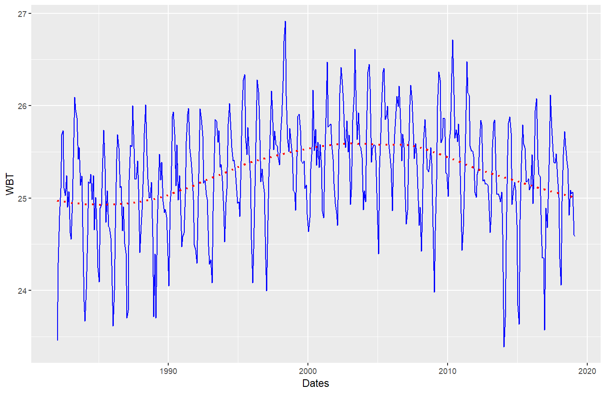
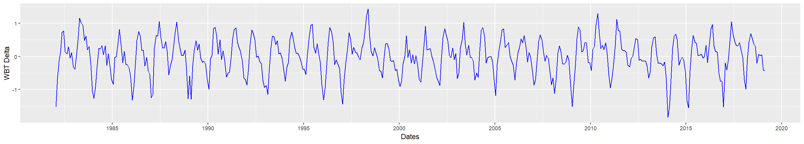
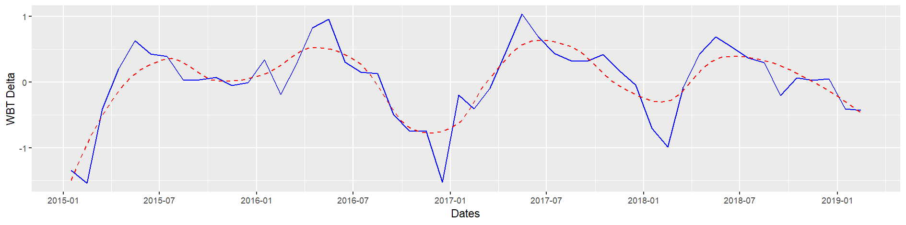
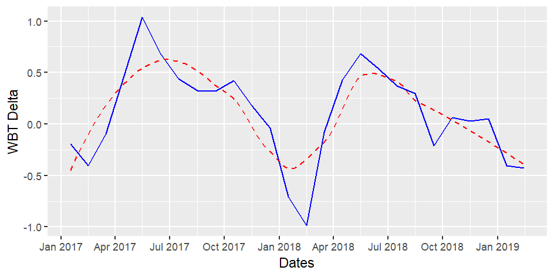

```{r setup, include=FALSE}
knitr::opts_chunk$set(echo = TRUE)
load("../workspace.RData")

require(ggplot2)
```

# Title

[Source](https://data.gov.sg/dataset/wet-bulb-temperature-hourly)

## Columns

- **Wbt Date**: Date of measurement
- **Time**: Time of measurement in hours
- **Wet Bulb Temperature-Hourly**: WBT value in Degree Celsius

## Goals

- We can find out trends in the WBT, allowing us to predict average WBT in the future

# Trends in WBT


***red*** *represents the smoothed loess model*

***blue*** *represents the original data*

Looking at the general There's 2 obvious trends in the graph:

- Its spikes seems to be consistent in frequency, hence we can predict that it's some sort of **sinusoidal function**.
- The plot seems to have a second function, represented by the loess model.

## The Sinusoidal Function

Let's look at the sinusoidal function only, we will subtract the original by the loess prediction, yielding us this.







### The Limits

```{r}
ggplot(wbt, aes(delta)) +
  geom_histogram(binwidth = 0.2)
round(quantile(wbt$delta, c(0,0.1,0.25,0.5,0.75,0.9,1)),2)
```
The crest and trough, $(-1.83, 1.43)$, for the periodic sequence seems to be roughly consistent throughout.

### Periodogram
```{r}
sde <- spectrum(wbt$delta)
per <- 1/sde$freq[sde$spec == sort(sde$spec, decreasing = T)[1:3]]

# This is the period calculated from the most likely frequency
per
```

The Periodogram tells us what's the most likely frequency for the plot.

We can calculate the period, the time taken for the loop to repeat, from the frequency. We will take the top 3 values which are the closest to the maximum.

$$\frac{1}{frequency} = period \approx (12.16, 11.84, 6) $$

This means that the dataset seems to repeat every 12.16, 11.84 and 6 months.

#### Different frequencies

What this tells us is that there's likely a 12 month loop and a 6 month loop.

Looking at the zoomed in plot, it's clear on why there is a 12 month loop. However, it is also apparent that the 6 month loop was detected due to a consistent notch around every August.

## Forecasting

Looking at the data we have gathered above, we can predict a few things with high certainty

### Forecast

$$ wbt = g(t) + s(t) + d(t) $$

- $g(t)$ The **General** trend for the WBT, as predicted by the **loess** model 
- $s(t)$ The **Sinusodial** loop, which happens every 12 months
- $d(t)$ The **Dip** in WBT around the 8th month

#### General Trend

Barring the sinusodial function, we can forecast that the **WBT** will, in general and average, drop for the immediate future.

#### Sinusodial Trend

Looking at the previous gathered data, the positive delta and negative delta will likely fall close to $(-1, 1)$ Celsius.

If we can pinpoint out the phase of the sine curve, we can forecast with high certainty the WBT for the next few months.

#### Dip Trend

Around every Aug from 2015, we can see a little dip in WBT. We can safely assume this phenomenon will be consistent throughout the future.
