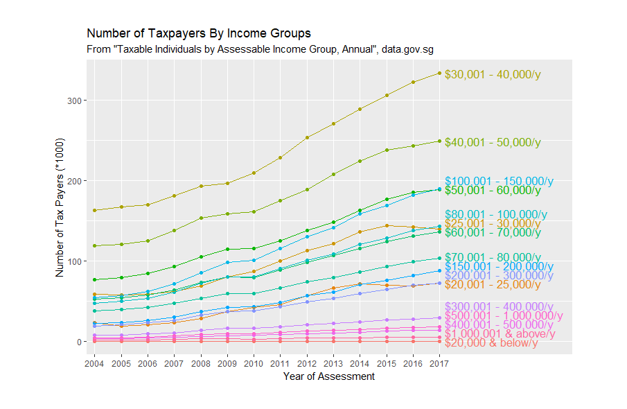

```{r setup, include=FALSE}
knitr::opts_chunk$set(echo = TRUE)
load("tax.RData")
```

# Taxation in Singapore

[Source](https://data.gov.sg/dataset/taxable-individuals-by-assessable-income-group-annual?view_id=9ba609ea-c65f-4630-a48e-4c562b5337bc&resource_id=65913425-8a0d-47ca-b9f7-569bca3ac688)

Source Notes:

- 'Assessable Income refers to the total income of an individual less allowable
  deductions such as business expenses, employment expenses and donations.'
- 'Chargeable Income of an individual is his/her assessable income less the
  personal reliefs allowed.'
- 'Net Tax Assessed is the net tax payable or repayable by an individual after
  taking into account allowable tax credits, tax remission, tax rebates and
  tax deducted at source.'
- 'Non-Tax Resident refers to an individual who has worked in Singapore for
  less than 183 days in the preceding year of the Year of Assessment.'

## Columns

- **Year of Assessment**: When the taxation assessment was conducted
- **Assessed Income Group**: Yearly income in SGD grouping
- **Type of Resident**: Non-Tax/Tax Resident, *refer to Source Notes*
- **Number of Taxpayers**
- **Assessable Income**: S$ Thousand
- **Chargeable Income**: S$ Thousand
- **Net Tax Assessed**: S$ Thousand

### Assessable Income

**Assessable Income**, as defined by the source, is the total **yearly** income, subtract allowance deductions such as business expenses, employment expenses & donations.

[Read more here (under Expenses and Donations)](https://www.iras.gov.sg/irashome/Individuals/Locals/Working-Out-Your-Taxes/Deductions-for-Individuals--Reliefs--Expenses--Donations-/)

In other words:

$$Income_{Assessable} = Income_{Yearly} - (expenses + donations)$$

### Chargeable Income

**Chargeable Income**, as defined by the source, is **Assessable Income** minus personal reliefs

[Read more here (under Reliefs)](https://www.iras.gov.sg/irashome/Individuals/Locals/Working-Out-Your-Taxes/Deductions-for-Individuals--Reliefs--Expenses--Donations-/)

In other words:

$$Income_{Chargeable} = Income_{Assessable} - reliefs = Income_{Yearly} - (expenses + donations + reliefs)$$

### Net Tax

**Net Tax**, as defined by the source, is the total Tax paid which after accounting into tax credits, tax remission, tax rebates, tax deducted at source

### Non-Tax Resident

**Non-Tax Resident** is a group that pays a different set of tax rates compared to a **Tax Resident**. A **Non-Tax Resident** is defined as:

- Singapore Citizen (SC) or Singapore Permanent Resident (SPR) who resides in Singapore except for temporary absences; or
- Foreigner who has stayed / worked in Singapore (excludes director of a company) for **183 days or more in the previous year**. i.e. the year before the YA.

[Read more here](https://www.iras.gov.sg/irashome/Individuals/Foreigners/Working-out-your-taxes/Tax-Rates-for-Resident-and-Non-Residents/)

## Goals

We can look at the surface trends of this data provided, such as:
- How has the economy grown over the years?
- Has the disparity between the income groups increased, what is the trend?
- How is tax related to the income groups, is it fair?

# Number of Taxpayers By Income Groups

Taxed amounts aside, we can analyse how many people are in specific **income groups** by looking at the data.

We will simply drop these data into a ggplot where we group them by their income groups.



```{r}
knitr::kable(tax.resident.grw.wide)
```


## Observations

It is a straightforward incline for all income groups from 2004 to 2019, however, there's some visible anomalies.

### Largest Income Group
$$[30k_{SGD}, 40k_{SGD}]/y \approx [2.5k_{SGD}, 3.3k_{SGD}]/m$$
It has always been the biggest group of taxpayers and it'll most likely stay that way for years to come.

### Declining Income Groups
*barring the very small income groups in which we will discuss later*
$$[20k_{SGD}, 25k_{SGD}]/y \approx [1.7k_{SGD}, 2.1k_{SGD}]/m$$
$$[25k_{SGD}, 30k_{SGD}]/y \approx [2.1k_{SGD}, 2.5k_{SGD}]/m$$

Both of the income groups' growth seems to be stamped down in the recent years:

- $[20k_{SGD}, 25k_{SGD}]/y$ growth goes into the negative in 2014, with a 4.4% rise in 2016
- $[25k_{SGD}, 30k_{SGD}]/y$ growth goes into the negative in 2015

### Global Financial Crisis of (around) 2008
An interesting observation is this would be how Singapore is affected during the the [Financial Crisis](http://eresources.nlb.gov.sg/history/events/3cacf256-82cc-4776-b7f8-83757723b502).

- Most Income Groups stagnated around that period or declined except those $< 30k_{SGD}/y$ in which increased in population readily.

## Forecasting

### Future Largest Income Group

I foresee that the dominating future income group would fall under $[30k_{SGD}, 40k_{SGD}]/y$, falling slightly below 1/5 of the population. A few reasons for the prediction:

- Between this and its following group, $[40k_{SGD}, 50k_{SGD}]/y$, the gap has **widened**, especially in the past few years.
- The two groups $[20k_{SGD}, 25k_{SGD}]/y + [25k_{SGD}, 30k_{SGD}]/y$ has decreased in population, shifting up in income groups, likely to $[30k_{SGD}, 40k_{SGD}]$


